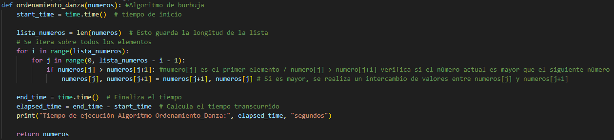

# Grupo 1 💜

## Integrantes 
- Barrozo Julieta
- Celis Marilyn
- Contrera Franco
- Cortes Malena

## Proyecto: Ordenamiento.

## Descripción 
En base a este video https://www.youtube.com/watch?v=kdtYU6VNfww&t=1s Se detallaron el paso a paso:
Primera ronda:
- Paso 1: El 0 y el 3 se enfrentan y cambian de posición.
- Paso 2: El 3 y el 1 cambian de lugar.
- Paso 3: El 1 y el 0 se enfrentan pero no cambian.
- Paso 4: El 3 y el 4 se enfrentan sin cambio.
- Paso 5: El 7 y el 4 se enfrentan sin cambio.
- Paso 6: El 7 y el 2 cambian de lugar.
- Paso 7: El 2 cambia con el 4.
- Paso 8: El 2 cambia con el 3.
- Paso 9: El 2 y el 1 se enfrentan sin cambio.
- Paso 10: El 7 y el 5 cambian de lugar.
- Paso 11: El 5 y el 4 se enfrentan sin cambio.
- Paso 12: El 7 y el 6 cambian de lugar.

Segunda ronda:
- Paso 1: El 0 y el 3 cambian de lugar.
- Paso 2: El 3 cambia con el 1.
- Paso 3: El 3 y el 4 se enfrentan sin cambio.
- Paso 4: El 4 y el 7 se enfrentan sin cambio.
- Paso 5: El 7 y el 2 cambian de lugar.
- Paso 6: El 7 cambia con el 5.
- Paso 7: El 7 cambia con el 6.
- Paso 8: El 0 y el 1 se enfrentan sin cambio.
- Paso 9: El 1 y el 3 se enfrentan sin cambio.
- Paso 10: El 3 y el 4 se enfrentan sin cambio.
- Paso 11: El 2 y el 4 cambian de lugar.
- Paso 12: El 4 y el 5 se enfrentan sin cambio.
- Paso 13: El 5 y el 6 se enfrentan sin cambio.
- Paso 14: El 1 y el 0 se enfrentan sin cambio.
- Paso 15: El 3 y el 1 se enfrentan sin cambio.
- Paso 16: El 2 y el 3 cambian de lugar.

## Ventajas y Desventajas
Ordenamiento de Danza
- Tiempo de ejecucion: 0,069 segundos
- Numero de comparaciones: Este algoritmo por cada iteracion compara un numero con el siguiente
- para determinar si es necesario realizar un intercambio,
- Ventajas: Es un algoritmo simple y facil de entender y es para listas chicas o casi ordenadas
- Desventajas: Tiene un mal rendimiento con listas grandes debido a su complejidad cuadratica

## :snake: Link al proyecto
- [QuickSort](https://onlinegdb.com/OPZZ4EQI3)
- [Coreografia](https://onlinegdb.com/aHRJ6hFYK)

---